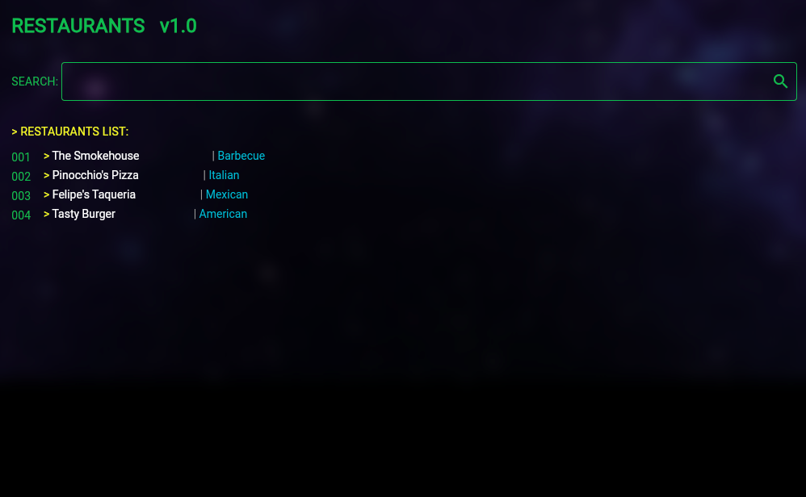
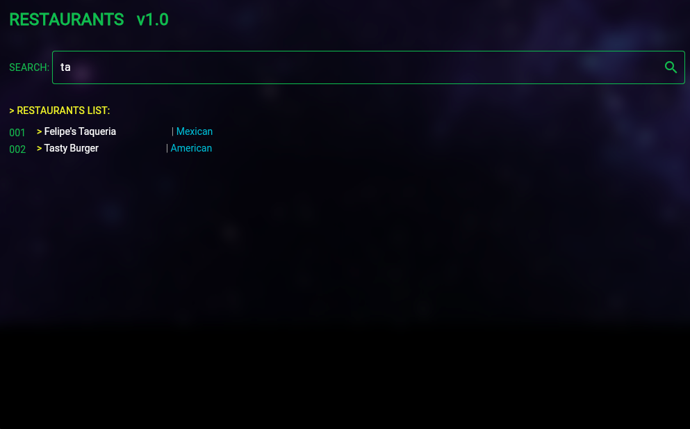

# Restaurant App



Restaurant App is a Flutter-based mobile application that displays a list of restaurants with a terminal-inspired user interface. The app allows users to search through the restaurant database and view details about each establishment.



## Features

- Terminal-style user interface
- Restaurant list display
- Search functionality

## Prerequisites

Before you begin, ensure you have met the following requirements:

- Flutter SDK (version 2.0.0 or later)
- Dart (version 2.12.0 or later)
- An IDE (e.g., Android Studio, VSCode)
- Git for version control

## Installation

1. Clone the repository:
   ```
   git clone https://github.com/mj-963/test_restaurant_app.git
   ```

2. Navigate to the project directory:
   ```
   cd test_restaurant_app
   ```

3. Install dependencies:
   ```
   flutter pub get
   ```

4. Run the app:
   ```
   flutter run
   ```

## Usage

1. Launch the app on your emulator or physical device.
2. Use the search bar at the top to filter restaurants by name.
3. Scroll through the list to view all available restaurants.
4. Each restaurant entry displays the name and cuisine type.

## Project Structure

```
lib/
├── models/
│   └── restaurant.dart
├── providers/
│   └── restaurant_provider.dart
├── screens/
│   └── home_screen.dart
├── services/
│   └── restaurant_service.dart
├── widgets/
│   ├── terminal_list_tile.dart
│   └── terminal_text_field.dart
└── main.dart
```

## Dependencies

- flutter_riverpod: ^2.5.1


## License

This project uses the following license: [MIT License]().